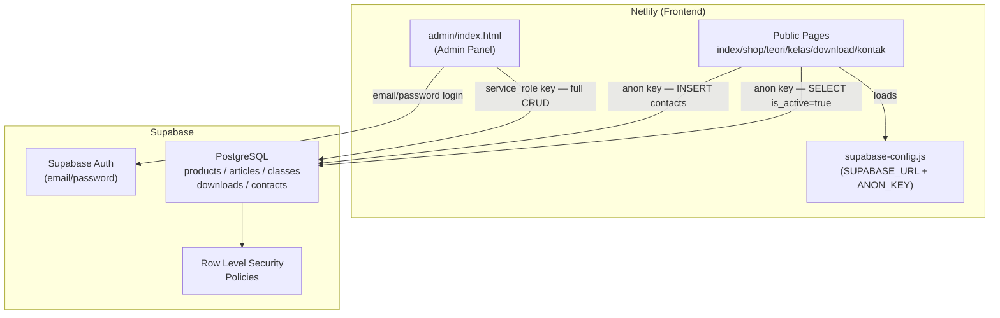

# Design Document — masjanis-cms

## Overview

Fitur ini mengubah website MasJanis dari static HTML menjadi CMS-driven website dengan backend Supabase. Stack tetap vanilla HTML/CSS/JS + Supabase JS SDK via CDN — tidak ada build step, tidak ada framework.

Arsitektur terbagi dua lapisan:

- **Public layer**: halaman-halaman yang sudah ada (`index.html`, `shop.html`, `teori.html`, `kelas.html`, `download.html`, `kontak.html`) dimodifikasi untuk mengambil data dari Supabase menggunakan `anon key`.
- **Admin layer**: folder baru `admin/` berisi `index.html` (single-page admin panel) yang menggunakan `service_role key` dan Supabase Auth untuk CRUD semua konten.

Tidak ada server-side rendering. Semua rendering dilakukan di sisi klien dengan JavaScript murni. Deploy tetap di Netlify (frontend) + Supabase (database + auth).

---

## Architecture



### Alur Data Public Pages

1. Halaman dimuat → tampilkan Skeleton_Card
2. Inisialisasi `supabaseClient` dengan `SUPABASE_URL` + `SUPABASE_ANON_KEY` dari `supabase-config.js`
3. Query Supabase: `SELECT * FROM {table} WHERE is_active = true`
4. Render kartu konten, ganti skeleton
5. Re-attach event listener filter tab dan search (jika ada)
6. Jika error → tampilkan Error_State; jika kosong → tampilkan Empty_State

### Alur Data Admin Panel

1. Cek sesi Supabase Auth → jika tidak ada, tampilkan form login
2. Login dengan email/password → simpan sesi
3. Admin memilih panel (Dashboard/Produk/Artikel/Kelas/Download/Pesan)
4. Panel aktif fetch data dari Supabase menggunakan `service_role key`
5. CRUD operations → update UI secara langsung tanpa reload halaman

---

## Components and Interfaces

### File Structure

```
/
├── supabase-config.js          ← BARU: konfigurasi terpusat (anon key)
├── index.html                  ← MODIFIKASI: section produk unggulan dinamis
├── shop.html                   ← MODIFIKASI: grid produk + modal dinamis
├── teori.html                  ← MODIFIKASI: grid artikel dinamis
├── kelas.html                  ← MODIFIKASI: grid kelas dinamis
├── download.html               ← MODIFIKASI: grid download dinamis
├── kontak.html                 ← MODIFIKASI: form submit ke Supabase
├── main.js                     ← MODIFIKASI: tambah helper CMS
├── styles.css                  ← MODIFIKASI: tambah skeleton + state styles
└── admin/
    └── index.html              ← BARU: admin panel (service_role key di sini)
```

### supabase-config.js

```js
// supabase-config.js
// Ganti nilai placeholder dengan kredensial Supabase Anda
const SUPABASE_URL = 'YOUR_SUPABASE_URL';
const SUPABASE_ANON_KEY = 'YOUR_SUPABASE_ANON_KEY';
```

File ini dimuat sebelum script lain di setiap halaman publik. Halaman admin **tidak** memuat file ini — admin mendefinisikan `service_role key` secara inline di `admin/index.html`.

### Public Client Initialization

Setiap halaman publik yang membutuhkan data mengikuti pola ini:

```html
<!-- Di bagian <head> atau sebelum script halaman -->
<script src="https://cdn.jsdelivr.net/npm/@supabase/supabase-js@2"></script>
<script src="/supabase-config.js"></script>
<script>
  // Guard: jika config belum diisi, tampilkan error state
  const isConfigured = SUPABASE_URL !== 'YOUR_SUPABASE_URL' && SUPABASE_ANON_KEY !== 'YOUR_SUPABASE_ANON_KEY';
  const supabase = isConfigured
    ? window.supabase.createClient(SUPABASE_URL, SUPABASE_ANON_KEY)
    : null;
</script>
```

### Admin Client Initialization

```html
<!-- admin/index.html — service_role key TIDAK pernah ada di halaman publik -->
<script src="https://cdn.jsdelivr.net/npm/@supabase/supabase-js@2"></script>
<script>
  const SUPABASE_URL = 'YOUR_SUPABASE_URL';
  const SUPABASE_SERVICE_KEY = 'YOUR_SERVICE_ROLE_KEY';
  const supabase = window.supabase.createClient(SUPABASE_URL, SUPABASE_SERVICE_KEY, {
    auth: { autoRefreshToken: true, persistSession: true }
  });
</script>
```

### Admin Panel — Single-Page Architecture

`admin/index.html` adalah single-page application sederhana. Navigasi antar panel dilakukan dengan JS (show/hide `<section>` elements), bukan dengan navigasi halaman.

```
admin/index.html
├── #loginView          ← form login (ditampilkan jika tidak ada sesi)
└── #dashboardView      ← konten admin (disembunyikan jika tidak ada sesi)
    ├── .sidebar        ← navigasi: Dashboard | Produk | Artikel | Kelas | Download | Pesan
    ├── #panelDashboard ← statistik 5 kartu
    ├── #panelProducts  ← tabel produk + form CRUD
    ├── #panelArticles  ← tabel artikel + form CRUD
    ├── #panelClasses   ← tabel kelas + form CRUD
    ├── #panelDownloads ← tabel download + form CRUD
    └── #panelContacts  ← tabel pesan + detail view
```

Panel switching:

```js
function showPanel(panelId) {
  document.querySelectorAll('.admin-panel').forEach(p => p.hidden = true);
  document.getElementById(panelId).hidden = false;
  // fetch data untuk panel yang baru aktif
  loadPanelData(panelId);
}
```

### Skeleton Loading Component

Skeleton card dirender sebagai HTML string dan diinjeksikan ke grid sebelum data tiba:

```js
function renderSkeletons(container, count = 3) {
  container.innerHTML = Array(count).fill(`
    <div class="skeleton-card">
      <div class="skeleton skeleton-img"></div>
      <div class="skeleton-body">
        <div class="skeleton skeleton-line short"></div>
        <div class="skeleton skeleton-line"></div>
        <div class="skeleton skeleton-line medium"></div>
      </div>
    </div>
  `).join('');
}
```

### Error State Component

```js
function renderError(container, retryFn) {
  container.innerHTML = `
    <div class="state-error">
      <div class="state-icon">⚠️</div>
      <p>Gagal memuat konten. Silakan coba lagi.</p>
      <button class="btn btn-outline btn-sm" onclick="(${retryFn.toString()})()">Coba Lagi</button>
    </div>
  `;
}
```

### Empty State Component

```js
function renderEmpty(container, message = 'Belum ada konten tersedia.') {
  container.innerHTML = `
    <div class="state-empty">
      <div class="state-icon">🌿</div>
      <p>${message}</p>
    </div>
  `;
}
```

### Filter Tab Re-attachment

Setelah render dinamis, filter tab di-re-attach karena DOM telah diganti:

```js
function attachFilterTabs(tabGroup, grid) {
  tabGroup.querySelectorAll('.filter-tab').forEach(tab => {
    tab.addEventListener('click', () => {
      tabGroup.querySelectorAll('.filter-tab').forEach(t => t.classList.remove('active'));
      tab.classList.add('active');
      const filter = tab.dataset.filter;
      grid.querySelectorAll('[data-category]').forEach(item => {
        item.style.display = (filter === 'semua' || item.dataset.category === filter) ? '' : 'none';
      });
    });
  });
}
```

### Payment Modal — Dynamic (shop.html)

Modal pembayaran tidak lagi di-hardcode per produk. Satu modal reusable diisi secara dinamis saat tombol "Beli Sekarang" diklik:

```js
function openPaymentModal(product) {
  document.getElementById('modalProductName').textContent = `${product.emoji} ${product.name}`;
  const iframeWrap = document.getElementById('modalIframeWrap');
  if (product.payment_url) {
    iframeWrap.innerHTML = `<iframe src="${product.payment_url}" width="100%" height="380" frameborder="0"></iframe>`;
  } else {
    iframeWrap.innerHTML = `<div class="payment-iframe-placeholder">...</div>`;
  }
  document.getElementById('paymentModal').classList.add('open');
}
```

---

## Data Models

### Supabase Schema SQL

```sql
-- ============================================================
-- PRODUCTS
-- ============================================================
CREATE TABLE products (
  id             UUID PRIMARY KEY DEFAULT gen_random_uuid(),
  name           TEXT NOT NULL,
  description    TEXT,
  price          INTEGER NOT NULL,
  original_price INTEGER,
  category       TEXT NOT NULL CHECK (category IN ('suplemen','minuman','perawatan','paket')),
  emoji          TEXT,
  badge_label    TEXT,
  is_active      BOOLEAN NOT NULL DEFAULT true,
  payment_url    TEXT,
  created_at     TIMESTAMPTZ NOT NULL DEFAULT now()
);

-- ============================================================
-- ARTICLES
-- ============================================================
CREATE TABLE articles (
  id             UUID PRIMARY KEY DEFAULT gen_random_uuid(),
  title          TEXT NOT NULL,
  excerpt        TEXT,
  category       TEXT NOT NULL CHECK (category IN ('tanaman-obat','ramuan','fitokimia','holistik','jamu','modern')),
  read_time      INTEGER,
  published_date DATE,
  emoji          TEXT,
  bg_class       TEXT CHECK (bg_class IN ('bg1','bg2','bg3','bg4','bg5','bg6')),
  is_active      BOOLEAN NOT NULL DEFAULT true,
  created_at     TIMESTAMPTZ NOT NULL DEFAULT now()
);

-- ============================================================
-- CLASSES
-- ============================================================
CREATE TABLE classes (
  id             UUID PRIMARY KEY DEFAULT gen_random_uuid(),
  title          TEXT NOT NULL,
  description    TEXT,
  instructor     TEXT,
  duration_hours INTEGER,
  video_count    INTEGER,
  level          TEXT NOT NULL CHECK (level IN ('pemula','menengah','lanjutan')),
  price          INTEGER NOT NULL,
  original_price INTEGER,
  emoji          TEXT,
  bg_class       TEXT CHECK (bg_class IN ('bg1','bg2','bg3','bg4','bg5','bg6')),
  is_active      BOOLEAN NOT NULL DEFAULT true,
  created_at     TIMESTAMPTZ NOT NULL DEFAULT now()
);

-- ============================================================
-- DOWNLOADS
-- ============================================================
CREATE TABLE downloads (
  id          UUID PRIMARY KEY DEFAULT gen_random_uuid(),
  title       TEXT NOT NULL,
  description TEXT,
  category    TEXT NOT NULL CHECK (category IN ('ebook','panduan','infografis','video')),
  file_size   TEXT,
  file_url    TEXT,
  emoji       TEXT,
  is_active   BOOLEAN NOT NULL DEFAULT true,
  created_at  TIMESTAMPTZ NOT NULL DEFAULT now()
);

-- ============================================================
-- CONTACTS
-- ============================================================
CREATE TABLE contacts (
  id         UUID PRIMARY KEY DEFAULT gen_random_uuid(),
  name       TEXT NOT NULL,
  email      TEXT NOT NULL,
  phone      TEXT,
  subject    TEXT,
  message    TEXT NOT NULL,
  is_read    BOOLEAN NOT NULL DEFAULT false,
  created_at TIMESTAMPTZ NOT NULL DEFAULT now()
);

-- ============================================================
-- ROW LEVEL SECURITY
-- ============================================================
ALTER TABLE products  ENABLE ROW LEVEL SECURITY;
ALTER TABLE articles  ENABLE ROW LEVEL SECURITY;
ALTER TABLE classes   ENABLE ROW LEVEL SECURITY;
ALTER TABLE downloads ENABLE ROW LEVEL SECURITY;
ALTER TABLE contacts  ENABLE ROW LEVEL SECURITY;

-- anon: SELECT only active rows (content tables)
CREATE POLICY "public read active products"
  ON products FOR SELECT TO anon
  USING (is_active = true);

CREATE POLICY "public read active articles"
  ON articles FOR SELECT TO anon
  USING (is_active = true);

CREATE POLICY "public read active classes"
  ON classes FOR SELECT TO anon
  USING (is_active = true);

CREATE POLICY "public read active downloads"
  ON downloads FOR SELECT TO anon
  USING (is_active = true);

-- anon: INSERT only on contacts
CREATE POLICY "public insert contacts"
  ON contacts FOR INSERT TO anon
  WITH CHECK (true);

-- service_role bypasses RLS by default in Supabase
-- (no additional policies needed for admin operations)
```

### TypeScript-style Type Definitions (referensi)

```ts
interface Product {
  id: string;
  name: string;
  description?: string;
  price: number;
  original_price?: number;
  category: 'suplemen' | 'minuman' | 'perawatan' | 'paket';
  emoji?: string;
  badge_label?: string;
  is_active: boolean;
  payment_url?: string;
  created_at: string;
}

interface Article {
  id: string;
  title: string;
  excerpt?: string;
  category: 'tanaman-obat' | 'ramuan' | 'fitokimia' | 'holistik' | 'jamu' | 'modern';
  read_time?: number;
  published_date?: string;
  emoji?: string;
  bg_class?: 'bg1' | 'bg2' | 'bg3' | 'bg4' | 'bg5' | 'bg6';
  is_active: boolean;
  created_at: string;
}

interface Class {
  id: string;
  title: string;
  description?: string;
  instructor?: string;
  duration_hours?: number;
  video_count?: number;
  level: 'pemula' | 'menengah' | 'lanjutan';
  price: number;
  original_price?: number;
  emoji?: string;
  bg_class?: 'bg1' | 'bg2' | 'bg3' | 'bg4' | 'bg5' | 'bg6';
  is_active: boolean;
  created_at: string;
}

interface Download {
  id: string;
  title: string;
  description?: string;
  category: 'ebook' | 'panduan' | 'infografis' | 'video';
  file_size?: string;
  file_url?: string;
  emoji?: string;
  is_active: boolean;
  created_at: string;
}

interface Contact {
  id: string;
  name: string;
  email: string;
  phone?: string;
  subject?: string;
  message: string;
  is_read: boolean;
  created_at: string;
}
```

---

## Correctness Properties

*A property is a characteristic or behavior that should hold true across all valid executions of a system — essentially, a formal statement about what the system should do. Properties serve as the bridge between human-readable specifications and machine-verifiable correctness guarantees.*

Fitur ini melibatkan logika bisnis yang dapat diuji secara property-based: validasi input, transformasi data, filtering, round-trip CRUD, dan guard logic. Property-based testing menggunakan library seperti [fast-check](https://github.com/dubzzz/fast-check) (JavaScript) cocok untuk memverifikasi properti-properti berikut.

---

### Property 1: Config guard menampilkan Error_State untuk semua nilai tidak valid

*For any* nilai `SUPABASE_URL` atau `SUPABASE_ANON_KEY` yang merupakan string kosong, nilai placeholder (`'YOUR_SUPABASE_URL'`, `'YOUR_SUPABASE_ANON_KEY'`), `null`, atau `undefined`, fungsi inisialisasi Public_Client SHALL mengembalikan `null` dan setiap grid konten SHALL menampilkan Error_State tanpa melempar uncaught exception.

**Validates: Requirements 1.4**

---

### Property 2: RLS — anon hanya melihat baris is_active=true

*For any* baris di tabel `products`, `articles`, `classes`, atau `downloads`, jika `is_active = false` maka query menggunakan `anon key` SHALL tidak mengembalikan baris tersebut; jika `is_active = true` maka query SHALL mengembalikannya.

**Validates: Requirements 2.6**

---

### Property 3: Admin session guard

*For any* state browser yang tidak memiliki sesi Supabase Auth yang valid (tidak ada sesi, sesi expired, sesi invalid), Admin_Panel SHALL menampilkan `#loginView` dan menyembunyikan `#dashboardView`. Setelah logout dari sesi yang valid, state SHALL kembali ke kondisi tanpa sesi.

**Validates: Requirements 3.5, 3.6**

---

### Property 4: Login error tidak mereset field email

*For any* kombinasi email dan password yang menghasilkan error autentikasi dari Supabase Auth, Admin_Panel SHALL menampilkan pesan error yang deskriptif dan nilai field email SHALL tetap sama dengan yang dimasukkan pengguna.

**Validates: Requirements 3.3**

---

### Property 5: Dashboard stats akurat terhadap data database

*For any* state database, angka yang ditampilkan di setiap kartu statistik dashboard (total produk aktif, total artikel aktif, total kelas aktif, total download aktif, pesan belum dibaca) SHALL sama dengan jumlah baris yang sesuai di database.

**Validates: Requirements 4.1**

---

### Property 6: CRUD round-trip — data tersimpan dan terbaca kembali

*For any* input data yang valid untuk tabel `products`, `articles`, `classes`, atau `downloads`, menyimpan data melalui form admin SHALL menghasilkan baris baru di database dengan nilai yang identik, dan baris tersebut SHALL muncul di daftar admin setelah operasi selesai.

**Validates: Requirements 5.2, 5.3, 6.2, 6.3, 7.2, 7.3, 8.2, 8.3**

---

### Property 7: Form edit terisi dengan data yang ada di database

*For any* item yang ada di database, membuka form edit untuk item tersebut SHALL mengisi semua field form dengan nilai yang identik dengan yang tersimpan di database.

**Validates: Requirements 5.4, 6.4, 7.4, 8.4**

---

### Property 8: Toggle is_active membalik nilai di database

*For any* item di tabel `products`, `articles`, `classes`, atau `downloads`, mengklik toggle is_active SHALL mengubah nilai `is_active` di database ke kebalikannya (`true` → `false` atau `false` → `true`).

**Validates: Requirements 5.6, 6.6, 7.6, 8.6**

---

### Property 9: CRUD error handling — form tetap terbuka

*For any* kondisi error (network failure, database error, validation error) yang terjadi saat operasi CRUD, Admin_Panel SHALL menampilkan pesan error yang deskriptif dan form yang sedang aktif SHALL tetap terbuka dengan data yang sudah diisi.

**Validates: Requirements 5.7**

---

### Property 10: Public pages merender semua item aktif dari database

*For any* set item dengan `is_active = true` di tabel yang sesuai, halaman publik (`shop.html`, `teori.html`, `kelas.html`, `download.html`) SHALL merender kartu untuk setiap item tersebut setelah data berhasil dimuat.

**Validates: Requirements 10.1, 11.1, 12.1, 13.1**

---

### Property 11: Filter tab hanya menampilkan item dengan kategori yang sesuai

*For any* nilai filter yang dipilih dan *for any* set item yang sudah dirender, hanya item dengan `data-category` yang sesuai dengan nilai filter SHALL terlihat; semua item lain SHALL tersembunyi. Filter "semua" SHALL menampilkan semua item.

**Validates: Requirements 10.5, 11.5, 12.5, 13.5**

---

### Property 12: Error state muncul untuk semua kondisi kegagalan fetch

*For any* kondisi kegagalan fetch data dari Supabase (network error, invalid credentials, server error), halaman publik SHALL menampilkan Error_State yang mengandung ikon, pesan deskriptif dalam Bahasa Indonesia, dan tombol "Coba Lagi". Mengklik tombol "Coba Lagi" SHALL memicu ulang fungsi fetch.

**Validates: Requirements 10.3, 11.3, 12.3, 13.3, 16.4, 16.6**

---

### Property 13: Skeleton diganti sepenuhnya setelah data dimuat

*For any* set data yang berhasil dimuat dari Supabase, tidak boleh ada elemen dengan class `skeleton-card` yang tersisa di DOM setelah render selesai.

**Validates: Requirements 16.3**

---

### Property 14: Payment modal menampilkan payment_url yang benar

*For any* produk yang memiliki `payment_url` yang tidak kosong, mengklik tombol "Beli Sekarang" untuk produk tersebut SHALL membuka modal pembayaran dengan `<iframe>` yang `src`-nya identik dengan `payment_url` produk tersebut.

**Validates: Requirements 10.6**

---

### Property 15: Beranda menampilkan maksimal 4 produk aktif

*For any* jumlah produk dengan `is_active = true` di database (termasuk 0, 1, 2, 3, 4, atau lebih dari 4), section produk unggulan di `index.html` SHALL menampilkan tidak lebih dari 4 kartu produk. Jika tidak ada produk aktif atau fetch gagal, section tersebut SHALL disembunyikan.

**Validates: Requirements 15.1, 15.3**

---

### Property 16: Form kontak — validasi dan round-trip

*For any* kombinasi input form kontak di mana setidaknya satu dari field wajib (nama, email, pesan) kosong atau hanya berisi whitespace, submit SHALL ditolak dan tidak ada request yang dikirim ke Supabase. *For any* input form kontak yang valid (semua field wajib terisi), submit SHALL menyimpan data ke tabel `contacts` dengan nilai yang identik, menampilkan pesan sukses, dan mereset form.

**Validates: Requirements 14.1, 14.2, 14.4**

---

### Property 17: Pesan kontak — is_read round-trip

*For any* pesan di tabel `contacts` dengan `is_read = false`, membuka detail pesan tersebut di Admin_Panel SHALL mengubah nilai `is_read` menjadi `true` di database, dan indikator visual untuk pesan tersebut SHALL berubah untuk mencerminkan status "sudah dibaca".

**Validates: Requirements 9.3, 9.4**

---

### Property 18: Daftar pesan diurutkan berdasarkan created_at descending

*For any* set pesan di tabel `contacts`, urutan tampilan di Admin_Panel SHALL sesuai dengan urutan `created_at` descending — pesan terbaru selalu muncul di posisi pertama.

**Validates: Requirements 9.1**

---

## Error Handling

### Strategi Umum

Semua operasi async (fetch data, CRUD, auth) mengikuti pola try/catch yang konsisten:

```js
async function fetchData(container, fetchFn, renderFn, retryFn) {
  renderSkeletons(container);
  try {
    const { data, error } = await fetchFn();
    if (error) throw error;
    if (!data || data.length === 0) {
      renderEmpty(container);
      return;
    }
    renderFn(container, data);
    // re-attach event listeners jika diperlukan
  } catch (err) {
    console.error(err);
    renderError(container, retryFn);
  }
}
```

### Error Scenarios

| Skenario | Halaman Publik | Admin Panel |
|---|---|---|
| Config tidak valid / placeholder | Error_State di semua grid | N/A |
| Network timeout / offline | Error_State + tombol Coba Lagi | Pesan error inline, form tetap terbuka |
| Supabase server error (5xx) | Error_State + tombol Coba Lagi | Pesan error inline |
| RLS violation (anon akses data non-aktif) | Data tidak dikembalikan (normal) | N/A |
| Auth gagal (login) | N/A | Pesan error, field email tidak direset |
| CRUD gagal | N/A | Pesan error inline, form tetap terbuka |
| Data kosong (0 item aktif) | Empty_State | Tabel kosong dengan pesan informatif |
| index.html — fetch gagal atau kosong | Section produk unggulan disembunyikan | N/A |

### Uncaught Exception Prevention

- Semua akses ke `supabase` client diawali dengan null check
- Semua operasi DOM diawali dengan null check pada elemen target
- Error dari Supabase SDK selalu di-catch dan ditampilkan sebagai UI state, bukan console error yang tidak tertangani

---

## Testing Strategy

### Pendekatan Dual Testing

Fitur ini menggunakan dua lapisan pengujian yang saling melengkapi:

1. **Unit tests / Example-based tests**: Menguji skenario spesifik, edge case, dan integrasi komponen
2. **Property-based tests**: Menguji properti universal yang berlaku untuk semua input valid

### Property-Based Testing

Library yang digunakan: **[fast-check](https://github.com/dubzzz/fast-check)** (JavaScript)

Konfigurasi minimum: **100 iterasi per property test**

Setiap property test harus diberi tag komentar yang mereferensikan property di dokumen desain ini:

```js
// Feature: masjanis-cms, Property 6: CRUD round-trip — data tersimpan dan terbaca kembali
test('CRUD round-trip untuk products', () => {
  fc.assert(fc.property(
    fc.record({
      name: fc.string({ minLength: 1 }),
      price: fc.integer({ min: 1000 }),
      category: fc.constantFrom('suplemen', 'minuman', 'perawatan', 'paket'),
      // ...
    }),
    async (productInput) => {
      // insert → fetch → compare
    }
  ), { numRuns: 100 });
});
```

### Unit Tests (Example-based)

Fokus pada:
- Skenario spesifik yang tidak tercakup oleh property tests (konfirmasi hapus, skeleton display)
- Integrasi antara komponen (filter tab + render dinamis)
- Edge case yang sulit di-generate secara random (payment_url kosong vs ada)

### Integration Tests

Fokus pada:
- Supabase Auth flow (login valid, session persistence)
- RLS policy enforcement (anon tidak bisa akses data non-aktif)
- End-to-end CRUD melalui Supabase SDK

### Test Coverage Targets

| Layer | Target |
|---|---|
| Property tests | Semua 18 properties di atas |
| Unit tests | Semua EXAMPLE dan SMOKE criteria |
| Integration tests | Auth flow, RLS, end-to-end CRUD |

### Manual Testing Checklist

- [ ] Verifikasi `service_role key` tidak muncul di source halaman publik
- [ ] Verifikasi skeleton card muncul sebelum data tiba (throttle network di DevTools)
- [ ] Verifikasi layout tidak shift saat skeleton diganti kartu asli
- [ ] Verifikasi modal pembayaran menutup dengan Escape key
- [ ] Verifikasi filter tab berfungsi setelah render dinamis
- [ ] Verifikasi form kontak direset setelah submit berhasil
- [ ] Verifikasi admin panel tidak dapat diakses tanpa login
